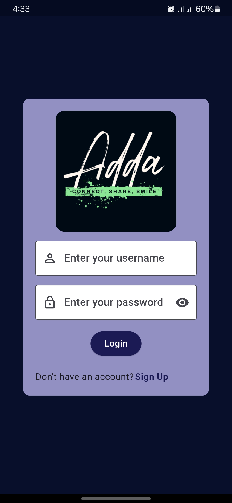
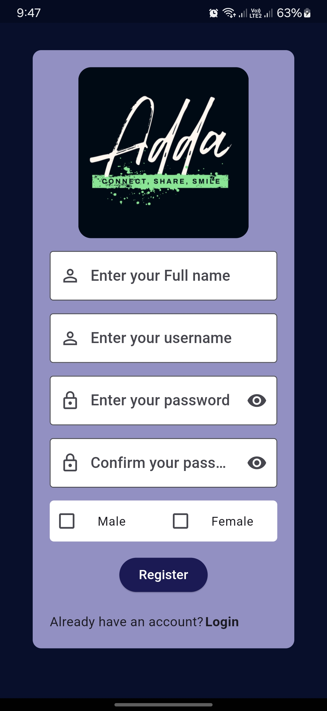

# Project Title: **Adda**


## Table of Contents
1. [Overview](#overview)
2. [Features](#features)
3. [Technology Stack](#technology-stack)
4. [Screenshots](#screenshots)
5. [Setup Instructions](#setup-instructions)
6. [API Documentation](#api-documentation)
7. [Contributing](#contributing)
8. [License](#license)

---

## Overview

**Adda** is a cross-platform application designed to chat. The app provides seamless integration between:
- A **web frontend** built with ReactJS.
- An **Android app** developed using Flutter.
- A **backend API** powered by Node.js and Express.js.

This project ensures fast, responsive, and secure communication between the user interface and backend services.

---

## Features
- 🔒 **Secure Authentication**: User login, logout, and token management.
- 📱 **Android**: Flutter Android app with an intuitive UI.
- 🌐 **Web Access**: Modern, interactive web frontend.
- 🌟 **Real-Time Updates**: Enabled via WebSockets (Socket.IO).
- 📊 **Scalable Backend**: Efficient API handling with Node.js.

---

## Technology Stack

### Backend:
- **Node.js**: Server runtime.
- **Express.js**: RESTful API framework.
- **MongoDB**: Database.

### Web Frontend:
- **React.js**: JavaScript library for UI development.
- **TailwindCSS & DaisyUI**: Styling.

### Android App:
- **Flutter**: Cross-platform mobile development.
- **Dart**: Programming language for Flutter.

---

## Screenshots
<p align="center" gap>
    
    
</p>


### Web Frontend:


### Flutter App:


---

## Setup Instructions

### Backend (Node.js)
1. Clone the repository:
   ```bash
   git clone https://github.com/your-repo.git
   cd your-repo/backend
